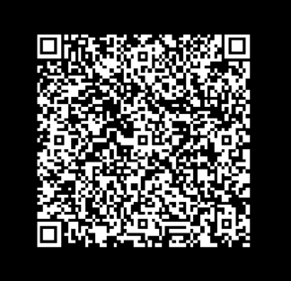

# MMM-News-QR

Create a QR-Code of the news which is currently showing in the default [Newsfeed](https://github.com/MagicMirrorOrg/MagicMirror/tree/master/modules/default/newsfeed) module.

Thanks to [Eugen](https://github.com/uxigene) for the inspiration of this module and the prework with your module [MMM-QRCode](https://github.com/uxigene/MMM-QRCode).

## Screenshot



## Installation

Open up your terminal and simply paste the following code:

```sh
cd ~/MagicMirror/modules
git clone https://github.com/nischi/MMM-News-QR
cd MMM-News-QR
npm install
```

## Setup the Module

Config | Description
--- | ---
`updateType` | Possible Values are `polling`, `push`. Push works only for MagicMirror 2.8+ because this Version has a Broadcast built in. Please make sure your newsfeed moduel has broadcastNewsFeeds activated.<br />**Default Value:** `push`
`interval` | If you set updateType to `polling` you need to set the interval of get the newsfeed information <br />**Default Value:** `2000`
`animationSpeed` | Animation Speed between change <br />**Default Value:** `2500`
`colorDark` | Color of the Code <br />**Default Value:** `#fff`
`colorLight` | Background color <br />**Default Value:** `#000`
`imageSize` | Size of the QR-Code in px <br />**Default Value:** `150`

### Full configuration example of the module

```js
    {
      module: "MMM-News-QR",
      position: "top_right",
      config: {
        // possible values (polling, push)
        // push only works with MagicMirror 2.8+ and broadcastNewsFeeds activated
        updateType: "push",
        // Interval to check the news
        // only needed if updateType is polling
        interval: 2000,
        // Animation between change
        animationSpeed: 2500,
        // Color of the Code
        colorDark: "#fff",
        // Background Color
        colorLight: "#000",
        // Size of the Code
        imageSize: 150
      }
    },
```

## Troubleshooting

Please check the QR code to see if it represents the correct URL. If `localhost:8080/cors?url=”` or something similar appears before the actual URL try to set `useCorsProxy` to `false` in your newsfeed config. Like this:

```js
    {
      module: "newsfeed",
      position: "top_right",
      config: {
        feeds: [
          {
            title: "tagesschau.de",
            url: "https://www.tagesschau.de/xml/rss2/",
            useCorsProxy: false
          }
        ]
      }
    },
```
